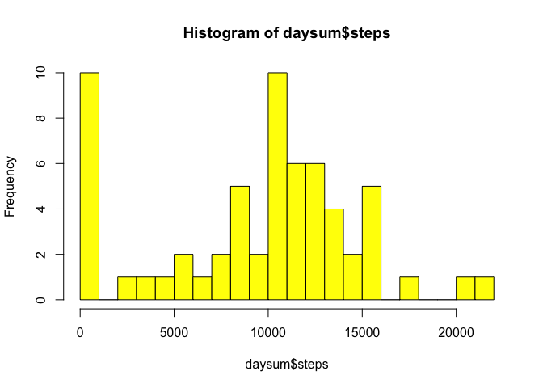
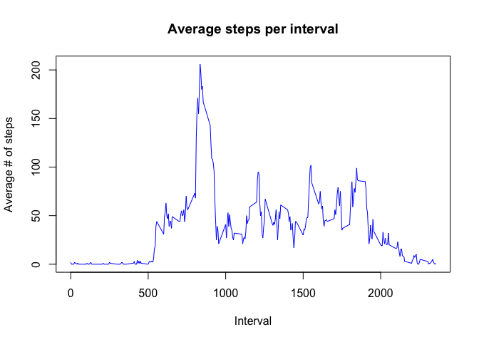
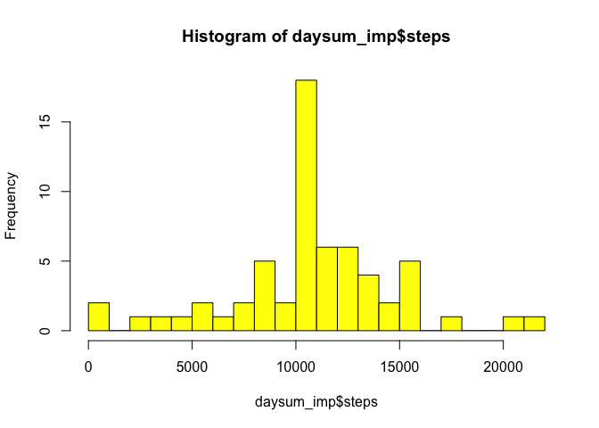
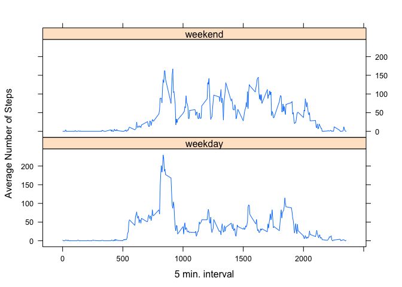

# Reproducible Research: Peer Assessment 1
Author: R.M. de Jong


## Loading and preprocessing the data

# Read the source file into var activity

```r
library(dplyr)
```

```
## 
## Attaching package: 'dplyr'
```

```
## The following objects are masked from 'package:stats':
## 
##     filter, lag
```

```
## The following objects are masked from 'package:base':
## 
##     intersect, setdiff, setequal, union
```

```r
library(lattice)
unzip("activity.zip", overwrite = TRUE)
rawsrc <- read.csv("activity.csv", na.strings = "", stringsAsFactors = FALSE)

activity <- rawsrc
activity$steps <- as.integer(na_if(activity$steps,"NA"))
activity$date <- as.Date(activity$date)
```


## What is mean total number of steps taken per day?


```r
## Calculate the total number of steps taken per day
daysum <- group_by(activity, date) %>%
  summarise(steps=sum(steps, na.rm=TRUE))

## Make a histogram of the total number of steps taken each day
hist(daysum$steps, breaks = 20, col="yellow")
```

<!-- -->

```r
## Calculate and report the mean and median of the total number of steps taken per day
total.nos.mean <- as.integer(round(mean(daysum$steps, na.rm=TRUE),0))
total.nos.median <- as.integer(round(median(daysum$steps, na.rm=TRUE),0))
```

The calculation of the total number of steps has a **mean of 9354** and a **median of 10395**. 


## What is the average daily activity pattern?


```r
## Make a time series plot (i.e. 𝚝𝚢𝚙𝚎 = "𝚕") of the 5-minute interval
## (x-axis) and the average number of steps taken, averaged across all days
## (y-axis)
avgsteps <- group_by(activity, interval) %>%
  summarise(avg_steps=round(mean(steps, na.rm=TRUE),0))

plot(avgsteps$interval,avgsteps$avg_steps, type="l", 
     main="Average steps per interval",
     xlab="Interval", ylab="Average # of steps",
     col="blue")
```

<!-- -->

```r
## Which 5-minute interval, on average across all the days in the dataset,
## contains the maximum number of steps?
nos.max <- top_n(avgsteps,1,avg_steps)
```

The 5-minute interval with the maximum number of steps based on this set with 2 months of data appears to be on 835


## Imputing missing values


```r
# Note that there are a number of days/intervals where there are missing values
# (coded as 𝙽𝙰). The presence of missing days may introduce bias into some
# calculations or summaries of the data.

# 1. Calculate and report the total number of missing values in the dataset
# (i.e. the total number of rows with 𝙽𝙰s)
no.nas <- sum(is.na(activity$steps))
 
# 2. Devise a strategy for filling in all of the missing values in the dataset.
# The strategy does not need to be sophisticated. For example, you could use the
# mean/median for that day, or the mean for that 5-minute interval, etc.

# >>>  I use the mean of the 5 min. interval for the selected months

# 3. Create a new dataset that is equal to the original dataset but with the
# missing data filled in.

activity_imputed <- left_join(activity,avgsteps, by="interval")
activity_imputed[is.na(activity$steps),]$steps <- activity_imputed[is.na(activity$steps),]$avg_steps
activity_imputed <- select(activity_imputed, -avg_steps)

# 4. Make a histogram of the total number of steps taken each day and Calculate
# and report the mean and median total number of steps taken per day. Do these
# values differ from the estimates from the first part of the assignment? What
# is the impact of imputing missing data on the estimates of the total daily
# number of steps?
daysum_imp <- group_by(activity_imputed, date) %>%
  summarise(steps=sum(steps))

hist(daysum_imp$steps, breaks = 20, col="yellow")
```

<!-- -->

```r
total.nos.mean <- as.integer(round(mean(daysum_imp$steps),0))
total.nos.median <- as.integer(round(median(daysum_imp$steps),0))
```

In the original data set there are 2304 interval where no data was available. A new data set has been created where the missing values have been filled in with the 2 month avarage number of steps of the corresponding interval.

This results in new values for the mean and median of total number of steps:

Item   | Value
------ | -----
mean   | 10766
median | 10762


## Are there differences in activity patterns between weekdays and weekends?


```r
# For this part the 𝚠𝚎𝚎𝚔𝚍𝚊𝚢𝚜() function may be of some help here. Use
# the dataset with the filled-in missing values for this part.
 
# 1. Create a new factor variable in the dataset with two levels – “weekday” and
# “weekend” indicating whether a given date is a weekday or weekend day.

activity_imputed <- mutate(activity_imputed, tmp_day=weekdays(activity_imputed$date))
activity_imputed$daytype <- factor(activity_imputed$tmp_day)

levels(activity_imputed$daytype) <- list(
  weekday = c("maandag", "dinsdag","woensdag","donderdag","vrijdag"),
  weekend = c("zaterdag", "zondag")
)
activity_imputed <- select(activity_imputed, -tmp_day)


# 2. Make a panel plot containing a time series plot (i.e. 𝚝𝚢𝚙𝚎 = "𝚕") of the
# 5-minute interval (x-axis) and the average number of steps taken, averaged
# across all weekday days or weekend days (y-axis). See the README file in the
# GitHub repository to see an example of what this plot should look like using
# simulated 

avgsteps_imp <- group_by(activity_imputed, interval, daytype) %>%
  summarise(avg_steps=round(mean(steps),0))

xyplot(data = avgsteps_imp , avg_steps~interval|factor(daytype),
       type='l',
       layout=c(1,2),
       xlab='5 min. interval', ylab='Average Number of Steps')
```

<!-- -->

**Conclusions:**

  * During weekdays activity starts earlier than in weekends
  * During weekdays activity concentrates in the morning whereas during weekends activity is spread across the day

